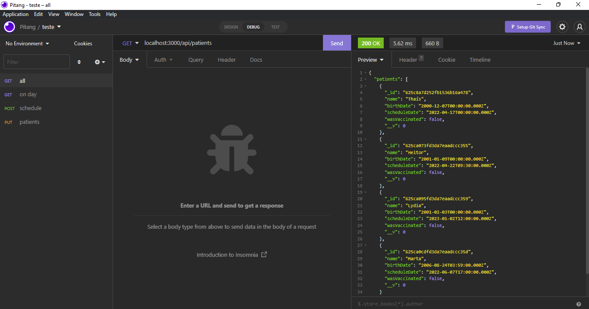

# Coronavirus vaccination backend

Description: _Application to schedule coronavirus vaccine, proposed by Pitang Agile IT's Trainee Project_

Project: [COVID19](https://github.com/users/thaisclxt/projects/2)

- Project linked to this repository based on Kanban cards with issues for each branch and linked pull requests
- You can see the timeline of the most recent commits to this repository and its network ordered by most recently pushed to, on [Network Graph](https://github.com/thaisclxt/covid19-backend/network)

## Database Setup

> I'm usign [MongoDB](https://www.mongodb.com/) database on [Docker](https://www.docker.com/). If you already have it on your pc, perfect, you can jump to "Recommended Installation"

1. Install Docker
2. Open your terminal to create a local MongoDB server
3. Run `docker volume create <volume_name>` to create a volume
4. Run `docker run -v <volume_name>:/data/db --name=<container_name> -p 27017:27017 -d mongo:5.0.6` to create a container from MongoDB official image
5. Run `docker exec -it <container_mongo_id> bash` to start a interactive session to be able to access MongoDB from the terminal
6. Now, inside the interactive session, you can run `mongo` to start MongoDB Shell
7. After clonning the repository on "Recommended Installation", you can see the database typing `show dbs;`
8. `use <database_name>`, `show collections` and `db.<database_name>.find().preety` to get all document

### Mongoose

> I choosed [Mongoose](https://mongoosejs.com/) as a ORM (Object-Relational Mapper) for MongoDB. When `mongoose.connect(DATABASE_URL)` is invoked, the database is created if it doesn't exist

## Recommended Installation

1. Make sure you have [Node.js](https://nodejs.org/en/) and [yarn](https://yarnpkg.com/) installed
2. Choose a directory on your pc to clone this repository
3. Run `git clone git@github.com:thaisclxt/covid19-backend.git` on the choosed directory
4. Run `yarn install` to install dependencies
5. Create a `.env` file based on `.env.example`
6. Run `yarn start` to start the app
7. Open [http://localhost:5000](http://localhost:5000) to view it in your browser or use [Insomnia](https://insomnia.rest/) to have a better experience with HTTP requests, for example:

### Restore database

1. Install [MongoDB Database Tools](https://www.mongodb.com/try/download/database-tools)
2. Run `mongorestore --db <database_name> dump/covid19`
